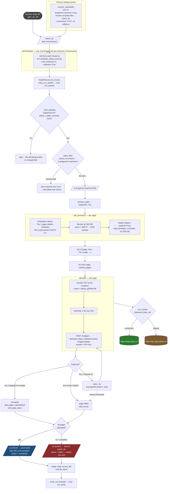

# Scanned-file data path

Traces a single scanned file from the moment it lands in an environment's watch
folder until every page is uploaded to the backend. Source of truth: the
`scanner/` package (`scheduler.py`, `batch.py`, `pdf_processor.py`,
`uploader.py`, `state.py`, `config.py`).

## Key facts

- **One file → one environment.** Routing is by watch folder; two enabled envs
  cannot share a `watch_dir`. Fan-out is at the *job* level — one `BatchRunner`
  per `(machine, environment)`, one APScheduler job per enabled env per machine.
- **Claim is an atomic `os.rename`** into `in-progress/<machine>/`, arbitrating
  between machines that share an SMB watch folder. A lost race just means a peer
  got the file.
- **300 DPI render** (`zoom = 300/72`) with two-tier orientation: PDF `page.rotation`
  metadata first, then Tesseract OSD only if metadata reports 0°.
- **Upload is per page**, TIFF/LZW lossless, rate-limited to 60 requests / 60s,
  retries 5xx and network errors (≤3, exponential backoff capped at 10s) but
  **never retries 4xx**.
- **Disposition:** all pages OK → `processed/`; any failure or exception → file
  goes **back to `watch_dir`** (no dedicated error folder) and is retried on a
  later poll. On startup, `recover_stranded()` returns files stranded in this
  machine's `in-progress/<machine>/` back to the watch dir.

## Diagram

